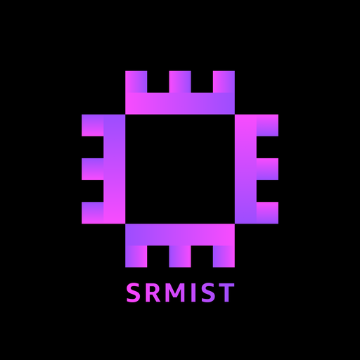

  

<h1 align="center">AWS SBG at SRMIST — Official Website</h1>

  Public website for the AWS Student Builder Group (AWSSBG) at SRMIST — home, projects, team, achievements, events, and an AI chatbot that answers visitor questions.

  
  
  
  
  
  
  
  
  

---

Made with ❤️ by Tech Team of AWS SBG at SRMIST

